# Hearth Studio — design a home *with* your agent

> A warm 3D interior-design studio that humans and AI agents share. Your agent sees the rooms, places furniture,
> checks clearances and door swings, shops a real Shopify catalog, and prepares checkout — through **40 WebMCP tools**
> registered on the page with `document.modelContext.registerTool`. You drag, it plans; both of you see the same scene.

**Live:** https://hearth.yadneshsalvi.com · **Video:** https://youtu.be/PHXlCjKWalQ · **Tools contract:** [TOOLS.md](TOOLS.md) · Licence: MIT


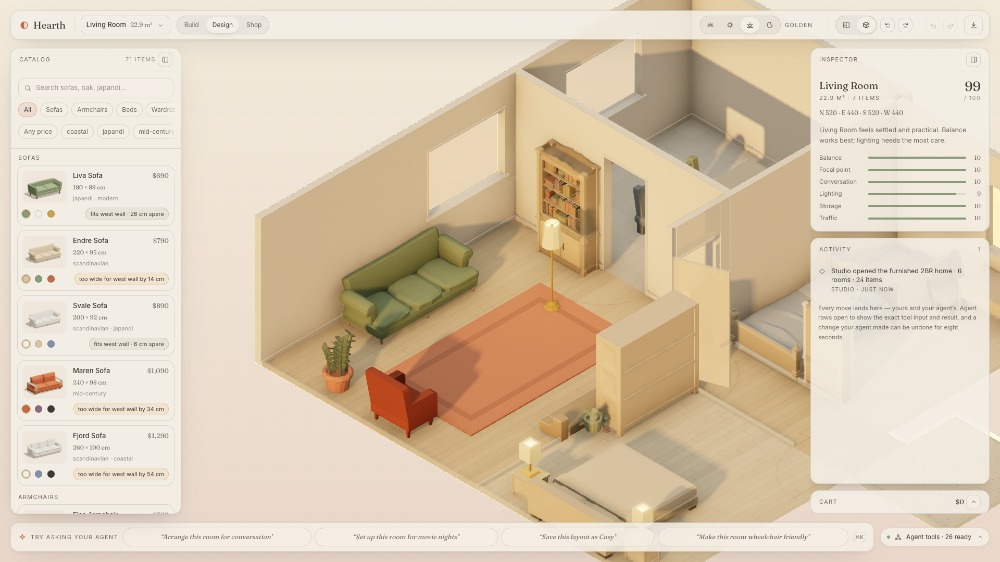

## Try it with your agent (2 minutes)

**ChatGPT desktop (recommended):** open the built-in browser (⌘⇧B), go to the live URL, and make sure *Settings → Browser →
Permissions → Enable site tools* is on (needs a GPT-5.6 Sol/Terra model). The address-bar arrow turns grey when Hearth's
tools are available. Then ask:

- "What rooms are in this home and what's in the living room?"
- "Find a sofa under $800 that fits the north wall and put it there facing the window."
- "Make the main bedroom wheelchair friendly and fix whatever gets in the way."
- "Set up the living room for movie nights, then show me the evening light."
- "Save this as *Before*, rearrange for conversation, save as *After*, and compare them."
- "Add everything in the living room to the cart and give me the checkout link."
- "Give me a 4-bedroom home, show me the whole thing, then take me into the main bedroom from the north."

**Chrome 152+ (no agent needed to see the tools):** enable `chrome://flags/#enable-webmcp-testing`, open the live URL, then
*DevTools → Application → WebMCP* lists every tool and lets you run them by hand. The **Model Context Tool Inspector**
extension works too. The production origin ships a WebMCP origin-trial token, so plain Chrome 149+ also exposes the tools.

**No WebMCP browser?** Click *Agent tools → Hearth Assistant*: an in-page agent (Chrome's WebMCP polyfill + `getTools()` /
`executeTool()`) drives the exact same tools, so the orb, receipts and undo behave identically. It runs under the same
guardrails as any agent: up to 60 tool calls per turn (`DEFAULT_MAX_CALLS_PER_TURN`), and destructive tools still open
the confirmation dialog.

## Controls

Everything here writes the same store actions the agent's tools do, so a human drag and a `set_view`
call land in one shared history. `?` opens the full map.

| Pointer | | Keys | |
|---|---|---|---|
| **Drag** the floor or background | pan — the scene follows the pointer | **[** · **]** | turn 45°: four corners, four elevations |
| **Right-drag** · **⇧ + drag** | orbit freely (pitch 15–75°) | **0** | reset to the framed shot |
| **Middle-drag** · two fingers | pan · pinch to zoom · twist to turn | **1** · **2** | plan · dollhouse |
| **Scroll** · trackpad pinch | zoom, 0.6× – 2.2× | **T** | morning · noon · golden · evening |
| **Double-click** the background | reset to the framed shot | **H** | frame the entire home, and back |
| **Click** a floor | make that room the active one | **R** · **⇧R** | turn the selected item |
| **Drag furniture** | move it, with magnets and live dimensions | **⌘Z** · **⇧⌘Z** | undo · redo |

**Layouts** in the top bar swaps the whole floor plan — or **imports your own**: drop a floor-plan image anywhere on the studio
and Hearth reads the room names, printed sizes, doors and windows, then builds the home to scale (furnished if you like).
**Build** mode edits rooms, doors and windows: resize a room from any corner and the neighbouring rooms move with the wall.
Select a piece and the inspector's **Size** steppers stretch it in cm (the 3D model follows); the catalog's **Match size**
chip ranks Shopify products by how close they are to it, and says *Same size* or the cm difference per side.

## What the agent can do

29 tools are registered the moment the page loads; 11 more appear when they make sense (a preview exists, two layouts are
saved, the cart has lines, or you switch to Build mode). Every tool description is ≤ 500 characters, every result ≤ 1.5 K,
per Chrome's guidance — enforced in CI. Full contract: [TOOLS.md](TOOLS.md).

| Read the scene | Design | Shop | Build |
|---|---|---|---|
| `get_scene_summary`, `get_room_details`, `get_selection`, `measure`, `get_conflicts`, `get_design_report` | `place_furniture`, `move_furniture` (semantic anchors: *against the north wall, facing the window, next to the sofa*), `resize_furniture` (width, depth, height or a percentage; the model stretches and every rule follows), `arrange_room`, `apply_palette`, `set_time_of_day`, `set_view`, `set_accessibility_mode`, `save_variant`, `load_variant`, `compare_variants`, `undo`, `clear_room`, `clear_home`, `restore_furniture` | `search_catalog` (filters, wall fit, and *closest size*: `like_item` or target cm → `exact` / `close` / `off` with the cm delta), `get_product` (`compare_to` a placed item), `preview_in_room`, `confirm_preview`, `update_cart`, `get_cart`, `get_checkout_link` | `apply_template`, `import_floor_plan` (a floor-plan image → rooms to scale, doors, windows, starter furniture), `create_room`, `update_room` (anchor corner, neighbours pushed), `add_opening`, `move_opening`, `remove_opening` |

```ts
// src/tools/registry.ts — one AbortController per tool group; groups appear/disappear with app state
document.modelContext.registerTool(
  {
    name: "place_furniture",
    title: "Place furniture",
    description: "Places a catalog product in a room as a new item. Position it with an anchor in words …",
    inputSchema, // zod → JSON Schema (draft-7), parameter descriptions ≤ 150 chars
    annotations: { readOnlyHint: false },
    async execute(input) {
      const parsed = schema.safeParse(input);           // validate strictly in code, loosely in schema
      if (!parsed.success) return { ok: false, error: "invalid", detail: firstIssue(parsed) };
      const placed = resolveAnchor(scene, room, product, parsed.data);   // engine does the geometry
      if (!placed.ok) return { ok: false, error: "blocked", detail: placed.detail, free_spans: placed.freeSpans };
      store.placeItem("agent", placed);                  // UI updates (orb flies, receipt logged) before we return
      return { ok: true, room, item, nudged_cm: placed.nudgedCm, conflicts: evaluateRoom(...), hint };
    },
  },
  { signal: groups.design.signal },
);
```

## What it looks like

| | |
|---|---|
| 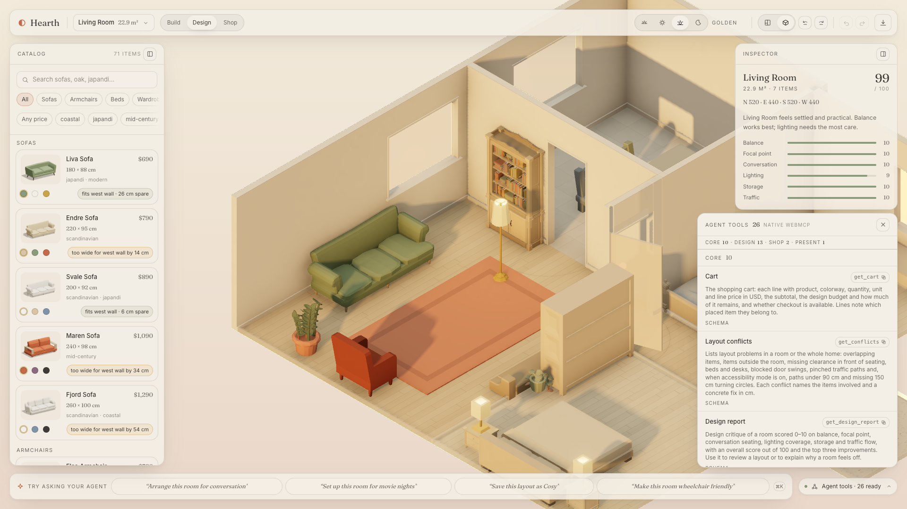 <br> **The tools, as an agent sees them** — 29 registered on load, each with its title, description and JSON Schema. |  <br> **Conflicts are diagrams, not error text** — a dashed door-swing arc, and a fix in centimetres. |
| 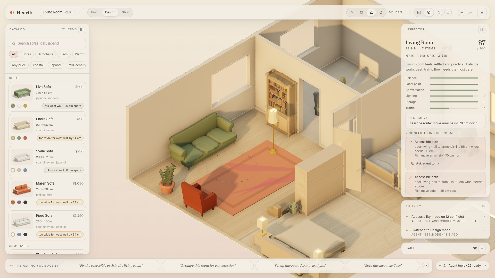 <br> **Accessibility mode** — 90 cm paths and Ø150 cm turning circles, checked by the engine. | 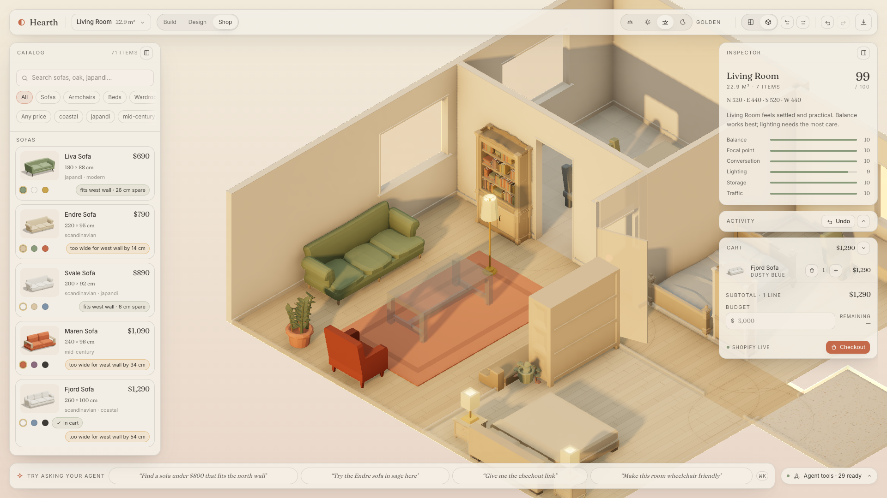 <br> **Try before you buy** — `preview_in_room` ghosts the product; confirming it adds the Shopify line. |
| 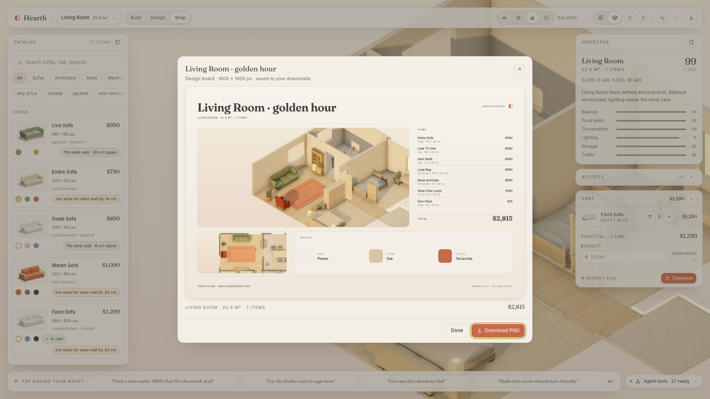 <br> **`export_design_board`** — one 1600 × 1000 PNG with the render, the plan, the palette and the bill. | 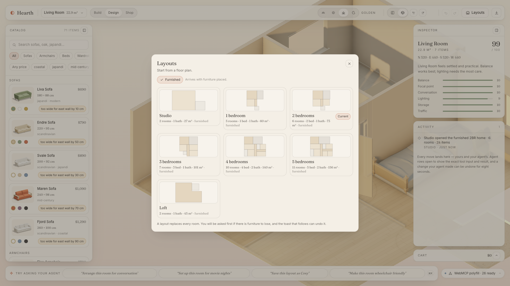 <br> **Seven floor plans, one click or one `apply_template`** — studio, 1–5 bedrooms and a loft, each arriving furnished and conflict-free. |
| 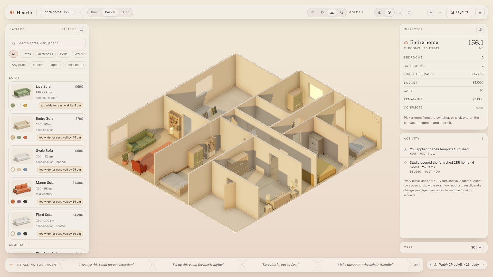 <br> **The whole home** — `H`, the room switcher or `set_view {focus:"home"}`; the studio pulls back here after every layout change. | 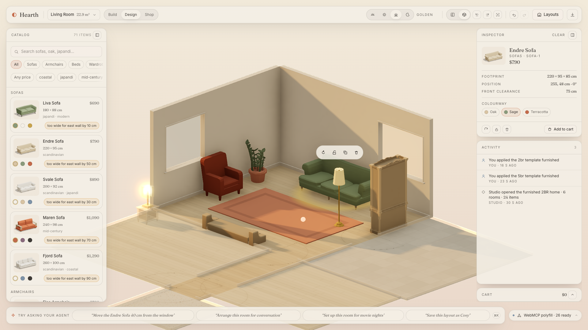 <br> **Your camera** — drag the floor to pan, right-drag to orbit, scroll to zoom, `0` to come home; walls and neighbours' furniture step aside. |
| 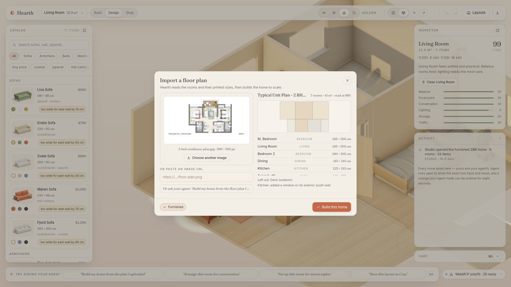 <br> **Your own floor plan** — drop an image, Hearth reads the room names and printed sizes, doors and windows, and shows what it will build; agents call `import_floor_plan`. | 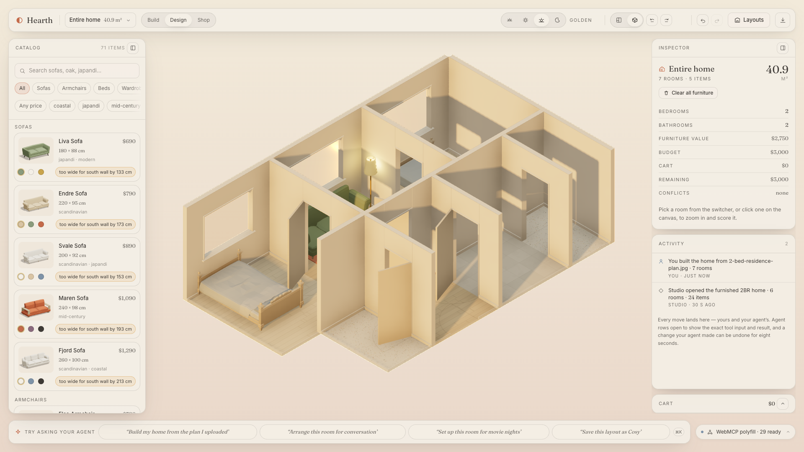 <br> **…built to scale** — shared walls, paired doors, an entrance, exterior windows and conflict-free starter furniture, ready to design. |
| 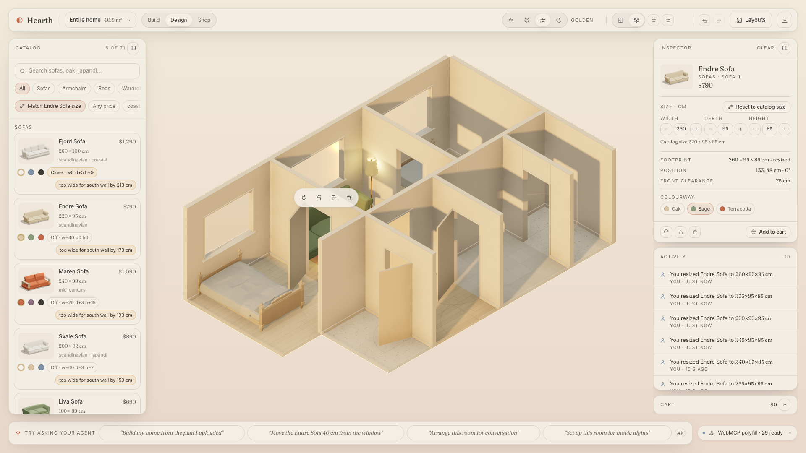 <br> **Exact sizes** — every piece has its cm; stretch it with the steppers or `resize_furniture`, and the catalog (or `search_catalog like_item`) ranks Shopify products by closeness: *Same size*, or the cm difference per side. | |

## How it's built

- **Engine** (`src/engine`, pure TypeScript, 180+ tests): room polygons → walls, footprints, free spans, door-swing arcs,
  clearance zones, A\* traffic paths, accessibility rules (90 cm paths, Ø150 cm turning circles), semantic anchors,
  four choreographed `arrange_room` styles, a design-report critic, and compact describers that keep every tool result
  under budget.
- **Store** (`src/state`): one zustand store with immer + zundo; every mutation is an action tagged `human | agent`, so
  the activity log is a shared history and undo works for both.
- **Registry** (`src/tools`): `defineTool` (zod → JSON Schema, budget assertions at definition time), group lifecycle
  with abort deferral (Chrome < 153 cancels in-flight executions on abort, so we never abort while a tool runs), an
  in-page confirmation gate for destructive tools, receipts, and a `toolchange` mirror that powers the Tools panel.
- **Renderer** (`src/scene`): React-Three-Fiber, orthographic plan/dollhouse camera, one lighting rig with four times of
  day, N8AO + ACES + restrained bloom, walls that fade when they block the view, CC0 low-poly furniture re-tinted
  through the palette, and the agent **orb** that flies to every action.
- **Shopify** (`src/shopify`, `app/api`): Storefront API 2026-07 (search, product, cart, checkout URL) behind route
  handlers; catalog metafields (`hearth.dims_cm`, `hearth.colorways`, …); a committed snapshot keeps browsing and
  previews working offline.
- **Quality**: `pnpm typecheck && pnpm lint && pnpm test` (63 files / 724 tests: engine, tools, budgets, UI, camera), 60 Playwright
  e2e specs (drag, catalog drop, confirm dialogs, compare, board, assistant, camera gestures, layouts), a `webmcp-evals` prompt suite in
  [`evals/`](evals/), and Lighthouse on the production build (performance 98 · accessibility 96 · best practices 100).

  | Eval suite (32 prompts × 2 runs, `evals/prompts.json`) | gpt-5.6-sol | claude-sonnet-5 |
  |---|---:|---:|
  | Key-call accuracy — right tool, right arguments, in order (`evals/reports/KEYCALL.md`) | **64/64** | **64/64** |
  | Strict positional trajectory (the CLI's own metric; extra context reads count as misses) | 52/64 | 41/64 |

## Run it locally

```bash
pnpm install
cp .env.example .env            # Shopify tokens optional: the catalog snapshot and a local cart work offline
pnpm dev                        # http://localhost:3000
pnpm test                       # engine + tools + budgets
pnpm test:e2e                   # Playwright (loads the WebMCP polyfill)
```

The same 30 Playwright specs also run against the bundle a visitor gets. The suite reads studio
state back through `window.__hearth*`, which a production build only installs when it is asked to —
so build with the switch on, then point the suite at it:

```bash
NEXT_PUBLIC_HEARTH_E2E=1 pnpm build && pnpm start --port 3210
PLAYWRIGHT_BASE_URL=http://localhost:3210 pnpm test:e2e
```

A build without that variable exposes nothing; `?e2e=1` on the URL turns the handles on for one
page load instead, which is what the specs append so any production build can be driven.

## Credits

Furniture models: CC0 sets by Kenney, Quaternius, Kay Lousberg (KayKit) and poly.pizza contributors — see
[`public/assets/CREDITS.md`](public/assets/CREDITS.md). WebMCP polyfill © Google LLC, Apache-2.0. Fonts: Fraunces, Inter (OFL).
Built for the WebMCP Challenge, 2026.
